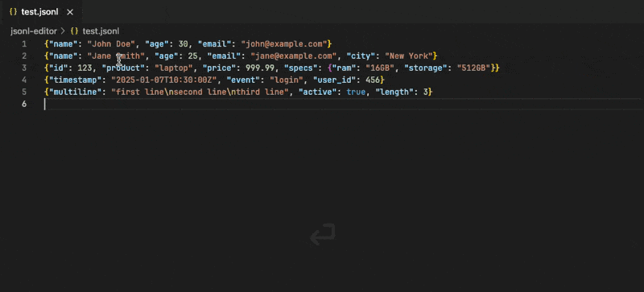
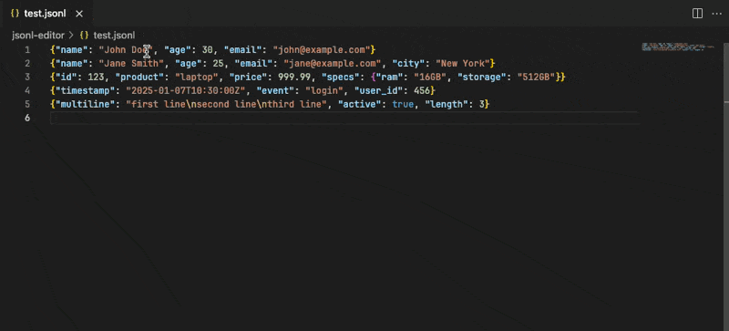

<div align="center">
  <div style="width: 160px">


  </div>

# JSONL Editor

</div>

## Features

- **Edit JSONL Lines**: Edit individual JSON lines in JSONL (JSON Lines) files. Open any line as formatted JSON in a new tab, edit it, and save to update the original JSONL file.
- **Preview JSONL**: Real-time preview of the JSON on the current line. The preview automatically updates as you move your cursor through the JSONL file.
- **Quick Actions**: Multiple ways to edit and preview JSON lines - Code Lens, Cmd/Ctrl+Click, Quick Fix menu, or from preview panel.

## How to Use

### Edit JSONL Line



There are multiple ways to edit a JSON line:

**Method 1: Cmd/Ctrl+Click (Recommended)**

1. Open a JSONL file.
2. Hold `Cmd` (macOS) or `Ctrl` (Windows/Linux) and click on any JSON line.
3. Edit the JSON in the new tab (formatted for easy editing).
4. Save (Ctrl+S / Cmd+S) to update the original JSONL file.

**Method 2: Quick Fix Menu**

1. Place your cursor on any JSON line.
2. Click the light bulb icon (💡) or press `Cmd+.` / `Ctrl+.`.
3. Select "Edit JSON line" from the menu.
4. Edit and save to update the original file.

**Method 3: Command Palette / Context Menu**

1. Place your cursor on any JSON line.
2. Open command palette and select `Edit JSONL line` or right-click and select from context menu.
3. Edit and save to update the original file.

### Preview JSONL



There are multiple ways to preview JSON lines:

**Method 1: Code Lens**

1. Open a JSONL file.
2. Click "Show Preview" link at the top of the file.
3. The preview panel will show the formatted JSON of the first line.
4. Use navigation buttons or move your cursor to see different lines.

**Method 2: Quick Fix Menu**

1. Place your cursor on any JSON line.
2. Click the light bulb icon (💡).
3. Select "Preview JSON line" to open preview for that specific line.

**Method 3: Command Palette / Context Menu**

1. Open a JSONL file.
2. Open command palette and select `Preview JSONL` or right-click and select from context menu.
3. The preview panel will show the JSON of the current line.

**Method 4: From Preview Panel**

- Once the preview panel is open, you can click the "Edit" button to directly edit the current line.
- Use "< Prev" and "Next >" buttons to navigate between lines.
- Or enter a specific line number to jump to it.

## Development

### Preview Template Development

To develop and test the preview template with live reload:

```bash
npm run preview-dev
```

This will:

- Start a development server at http://localhost:3000
- Display the preview template with sample JSON data
- Auto-reload when you modify `src/preview-template.html`

## Others

[Issues](https://github.com/toiroakr/jsonl-editor/issues)

[Releases](https://github.com/toiroakr/jsonl-editor/releases)
