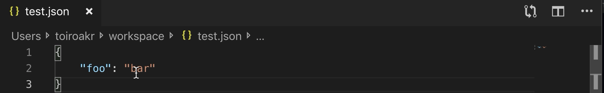

  

  
  

  # JSONL Editor

## Features
Edit individual JSON lines in JSONL (JSON Lines) files. Open any line as formatted JSON in a new tab, edit it, and save to update the original JSONL file.

## How to Use
### 1. Open a JSONL file and place your cursor on any JSON line.
Each line in a JSONL file should be a valid JSON object.

### 2. Open command palette and select `Edit JSONL line`.
Or right-click and select the command from the context menu.

### 3. Edit the JSON in the new tab.
The JSON will be formatted for easy editing.

### 4. Save (Ctrl+S / Cmd+S) to update the original JSONL file.
The JSON will be minified and written back to the same line in the JSONL file.

## Others
[Issues](https://github.com/toiroakr/jsonl-editor/issues)

[Releases](https://github.com/toiroakr/jsonl-editor/releases)
